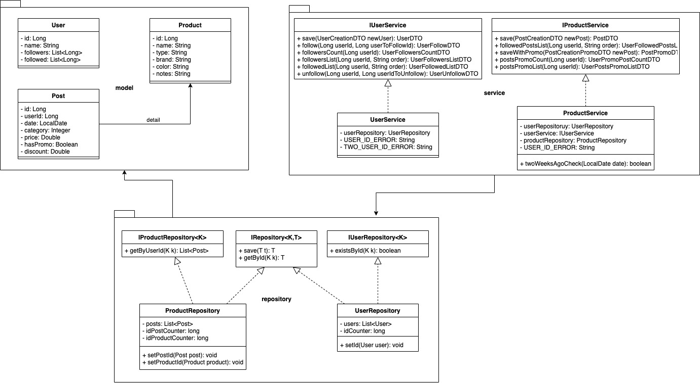

# SocialMeli - Desafio Spring 1

Solución planteada para el desafío de Spring número 1. 

## Consideraciones

- No se distinguen los usuarios entre Vendedores y Compradores. Cualquier usuario puede seguir a otro. Cualquier usuario puede publicar un posteo. 
- Se agrego un endpoint para crear usuarios. Al correr la app no se carga ningún usuario por defecto. Se debe crear cada usuario manualmente. 
- Al realizar un POST de un posteo o un producto *no se pasan los ids* en el payload. Los ids se manejan automáticamente desde el repositorio (revisar payloads de endpoints). 
- Los ids deben ser positivos mayores a 0 (cero).
- Cuando se utilizan filtros de asc y desc, se toma por defecto el valor asc si no se pasa ningun filtro. 

## Entity Model Diagram



## Endpoints

 - **Crear nuevo usuario**
	 - `/users`
	 - *POST*
	 - Ejemplo Payload:
   ```json
    {
      "user_name": "name"
    }
    ```
- **Follow (Seguir) a un usuario**
	- `/users/{user_id}/follow/{user_id_to_follow}`
	- *POST*
- **Obtener el resultado de la cantidad de usuarios que siguen a un determinado vendedor**
	- `/users/{user_id}/followers/count`
	- *GET*
- **Obtener un listado de todos los usuarios que siguen a un determinado vendedor. El listado puede ser ordenado alfabéticamente por nombre de usuario**
	- `/users/{user_id}/followers/list`
	- `/users/{user_id}/followers/list?order=name_asc`
	- `/users/{user_id}/followers/list?order=name_desc`
	- *GET*
- **Obtener un listado de todos los vendedores a los cuales sigue un determinado usuario**
	- `/users/{user_id}/followed/list`
	- `/users/{user_id}/followed/list?order=name_asc`
	- `/users/{user_id}/followed/list?order=name_desc`
	- *GET*
- **Dar de alta una nueva publicación**
	- `/products/post`
	- *POST*
	- Ejemplo Payload:
  ```json
  {
	"user_id": 1235,
	"date": "29-04-2021",
	"detail": {
		"product_name": "Silla Gamer",
		"type": "Gamer",
		"brand": "Racer",
		"color": "Red & Black",
		"notes": "Special Edition"
	},
	"category": 100,
	"price": 1500.50
  }
  ```
- **Obtener un listado de las publicaciones realizadas por los vendedores que un usuario sigue en las últimas dos semanas (para esto tener en cuenta ordenamiento por fecha, publicaciones mas recientes primero).**
	- `/products/followed/{user_id}/list`
	- `/products/followed/{user_id}/list?order=date_asc`
	- `/products/followed/{user_id}/list?order=date_asc`
	- *GET*
- **Unfollow (dejar de seguir) a un determinado vendedor.**
	- `/users/{user_id}/unfollow/{user_id_to_unfollow}`
	- *POST*
- **Publicar un nuevo producto en promoción**
	- `/products/promo-post`
	- *POST*
	- Ejemplo Payload:
	  ```json
	  {
		"user_id": 1235,
		"date": "29-04-2021",
		"detail": {
			"product_name": "Silla Gamer",
			"type": "Gamer",
			"brand": "Racer",
			"color": "Red & Black",
			"notes": "Special Edition"
		},
		"category": 100,
		"price": 1500.50,
		"has_promo": true,
		"discount": 0.35
	  }
	  ```
- **Obtener la cantidad de productos en promoción de un determinado vendedor**
	- `/products/{user_id}/promo-post/count`
	- *GET*
- **Obtener un listado de todos los productos en promoción de un determinado vendedor**
	- `/products/{user_id}/list`
	- *GET*

## Mejoras

 - Mejor y más ordenado manejo de excepciones. 
 - Mejora en validaciones de tipos. 
 - Implementación de base de datos y uso de librerías y frameworks para realizar operaciones sobre esta. 
 - Agregar testing unitario.
 - Documentacion de codigo.
